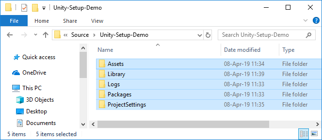

# Setting Up A Unity Project On GitHub

## Somebody in the group

* Create a new repository on GitHub for the project.
  - Make sure you:
    - Tick the **Initialize the repository with a README** checkbox.
    - Add a .gitignore for Unity.
    - If you skip these steps you will not be able to clone the repository until some content has been added to it.
  - If you will have collaborators, send them invitations.
* Start a new Unity project and push it to GitHub.
  - Once Unity is done (open), close it (Unity does not like you moving a project while it is open).
  - Using GitHub Desktop, clone the project repository to your computer.
  - Move the folders from the Unity project into the cloned repository.
    - Use the **Show in Explorer** button in GitHub Desktop to go to the folder you just cloned.
    - Type **Control-N** to open a new Explorer window, then go to the folder holding the Unity project that you just created.
    - Drag the folders to your cloned repository.
    
  - In GitHub Desktop, add a summary and commit the changes.
  - Push the changes back to GitHub.
  
## Everybody in the group

1. Clone the repository (the clone is your working copy).
1. Create a branch for your work.
1. Commit something useful to the branch and push it. Ideas:
   - A list of sprites (or create the Sprites folder and add some placeholders - or even final sprites).
   - Update the work breakdown.
   - Notes on your tasks.
   - Make a note about naming conventions and rename the SampleScene.
1. Fetch the origin (check for changes contributed by your collaborators).
   - Pull if necessary.
