---
---

# Pong in Unity - Tutorial 1: Building a prototype

{: width="200px" }

This is the first of a four part series of tutorials for building your own version of the classic arcade game [Pong][] in [Unity][].

* Tutorial 1: build a prototype to test and tune the core mechanic of the game.
* [Tutorial 2][tutorial2]: turn the prototype into a playable game with scoring and a restart button.
* [Tutorial 3][tutorial3]:
* [Tutorial 4][tutorial4]:

The examples use the [JetBrains Rider IDE][rider] for editing Unity's [C#][] scripts, but you can use any editor that you prefer. The tutorials build on each other, so it makes sense for everyone to start at the beginning.

[pong]: https://en.wikipedia.org/wiki/Pong
[unity]: #
[rider]: #
[c#]: #

[tutorial2]: #
[tutorial3]: #
[tutorial4]: #

Inspriration comes from a number of Pong in Unity tutorials, including:

* [Noobtuts: Unity 2D Pong Game][noobtuts]
* [Awesome Inc U: Make A Pong Game With Unity 2D][awesome]
* Vincent Quarles: Building a Pong Clone in Unity:
  - [Part 1: Retro Revolution: Building a Pong Clone in Unity][quarles1]
  - [Part 2: Building a Pong Clone in Unity: UI and Gameplay][quarles2]

[noobtuts]: https://noobtuts.com/unity/2d-pong-game/
[awesome]: https://www.awesomeincu.com/tutorials/unity-pong/
[quarles1]: https://www.sitepoint.com/retro-revolution-building-a-pong-clone-in-unity/
[quarles2]: https://www.sitepoint.com/building-a-pong-clone-in-unity-ui-and-gameplay/

## 1: Create A New Project In Unity
1. Launch Unity, you will see the launch dialog:
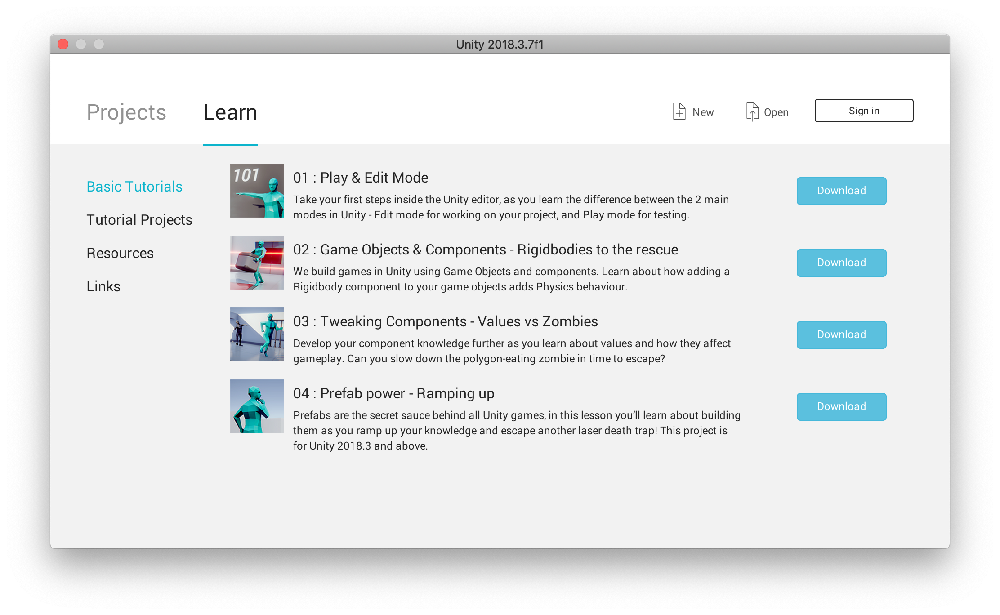
1. Click on the **New** button. The new project dialog will open with defaults filled in. You will need to change them:
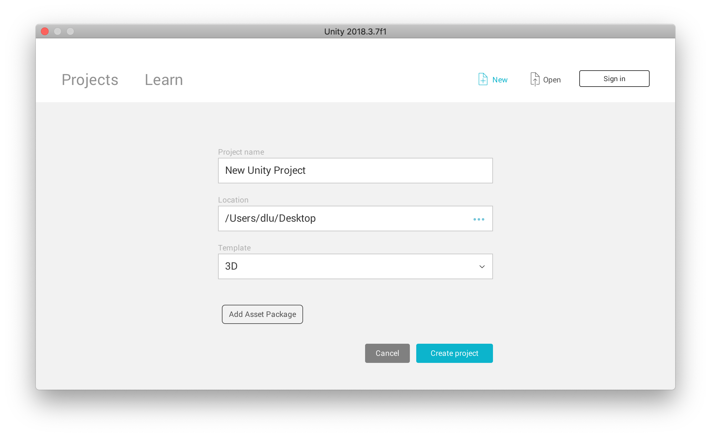
1. Name your project and select the 2D template. Double check that the project location is not on the **C:** drive. On Windows your settings should be similar to these:
   - Name: **Pong**
   - Location: **U:\Game Design 2\Games**
   - Template: **2D**

   If you are working on macOS or Linux, you settings should be similar to the ones in the screen capture. After double checking, click on the **Create project** button and Unity will initialize your project. This will take a while, as Unity works it will relaunch itself and it will display some progress bars.
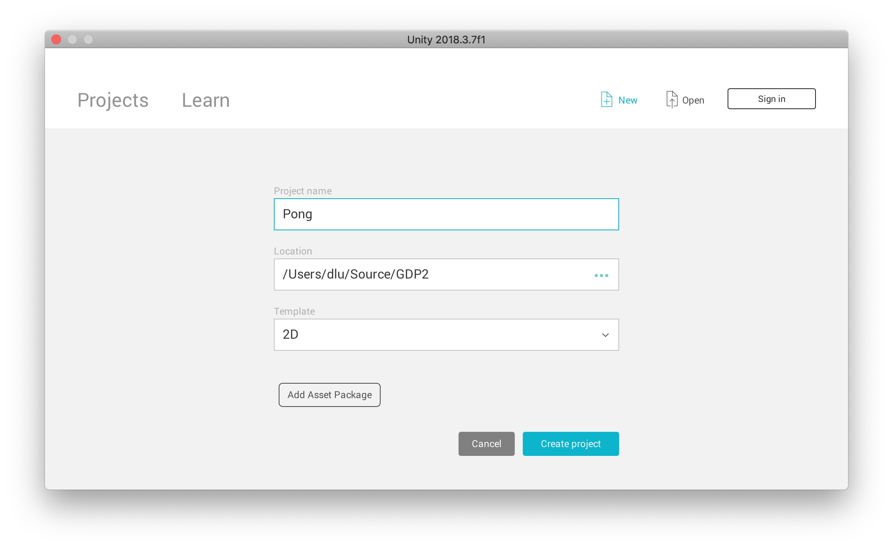

## 2: Learn Your Way Around The Unity UI (User Interface)

When Unity opens, the display will look something like this screen capture:

The layout of the Unity UI is customizable, so don't worry if what you see looks different. Tutorials, especially video tutorials are easier to follow if your UI layout matches the tutorial, so the first thing we will do is explore the UI and learn how to adjust the layout.

### Major UI Elements

The Unity UI is divided into several panes, each of the panes is numbered to correspond with its description. Each of the panes serves a different purpose. Read the descriptions of each of the panes and find the panes on your computer.

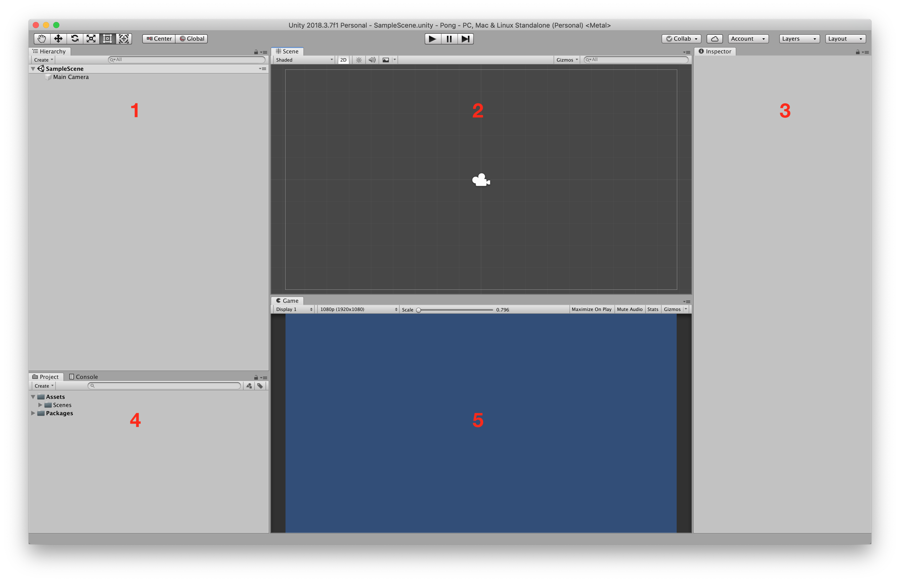

1. **[Hierarchy](https://docs.unity3d.com/Manual/Hierarchy.html)** - the Hierarchy pane displays a list of all of the game objects in your project. You can see the "family" (parent-child, sibling) relationships of game objects in the Hierarchy pane. When you add a game object by dragging it to the Hierarchy view, its transform is set to the origin. 
1. **[Scene](https://docs.unity3d.com/Manual/UsingTheSceneView.html)** - the Scene view pane provides a graphical display of the game objects in your project. When you add a game object by dragging it to the Scene view, its transform is set to the location where you dropped it. 
1. **[Inspector](https://docs.unity3d.com/Manual/UsingTheInspector.html)** - the Inspector pane displays the *components* and *properties* of the selected game object. You select a game object by clicking on it in the Hierarchy or Scene views. 
1. **[Project][]** & **[Console](https://docs.unity3d.com/Manual/Console.html)** - the Project pane is a view of files that make up your project. You can manage them directly in the Project pane. The Console pane shows messages from Unity: compiler errors, run-time messages from calls to **[Debug.Log()](https://docs.unity3d.com/ScriptReference/Debug.Log.html)**.
1. **[Game](https://docs.unity3d.com/Manual/GameView.html)** - the Game view pane is where you test your game.

[project]: https://docs.unity3d.com/Manual/ProjectView.html
   
### Controls

The Unity **[Toolbar](https://docs.unity3d.com/Manual/Toolbar.html)** provides access to some commonly used controlls, including:

*  - Transform Tools to scale and move game objects in the Scene view.
*  - Play Buttons allow switching between Unity's Edit and Play (testing) modes.
*  - Layout Drop Down menu for [customizing your workspace][customizing].

[customizing]: https://docs.unity3d.com/2018.3/Documentation/Manual/CustomizingYourWorkspace.html

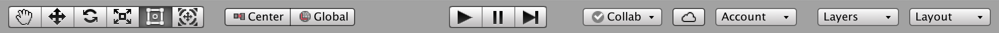

#### Configure Your Workspace

Before you go on, take some time read the section of the [Unity Manual]() on [Customizing Your Workspace][customizing] and set up your workspace to match the example above. This will make it easier to follow these tutorials. If you are planning to use a different tutorial, you may prefer to use its workspace layout as your model.

Once you have your workspace customized, save your layout.
   
### Menus

Unity's **menu bar** at the top of the Unity window gives you access to most Unity commands without needing to know their keyboard shortcuts. Some of the menus are probably familiar to you - but some, for example **Assets, Game Objects,** and **Components** are probably not. Take some time to check them out as you could use them to create all of the elements that you add to your game.

Because you use those functions so often, Unity has multiple ways to access them. In addition to the menu bar, you can also:

* **Right-click** in a pane to get a context menu.
* Use the **Create** drop-down menu in the Project and Hierarchy panes.
* Use the **Add Component** button in the Inspector.

That's enough for now. Let's start building the game.

## 3: Make A Plan

* Collect our assets
* Paddles
* The Ball
* Edges

## 4: Collect & Organize the Game Assets

Take a look at the [Project pane][project], it provides you with a "tidy" view of the files that define your project. It should look like the example below:

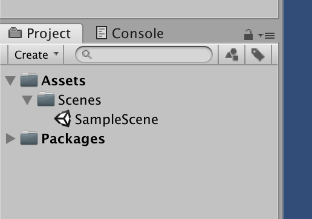

If it does not, but looks like this one instead, you missed the part about changing the Project pane to **1 Column Layout** - you want to do this, it makes it much easier to navigate.

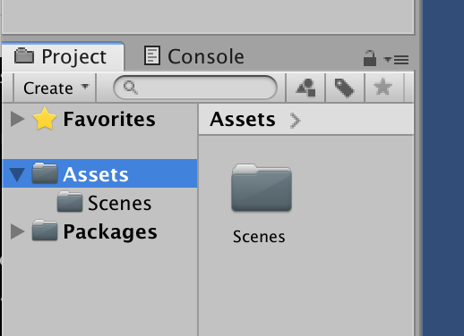

Ok, let's go:

### Create a Sprites and a Scripts folder

Even on a small project it can help to have your assets well organized, for big projects it is essential. We know that we are going to be adding sprites and creating scripts. Let's make folders for them:

1. Click on the **Assets** folder to select it.
1. Right-click to bring up the Project pane context menu.
1. Select **Create** at the top of the menu, then left-click on **Folder** on the resulting fly-out menu.
1. Rename the new folder from **New Folder** to **Sprites.**

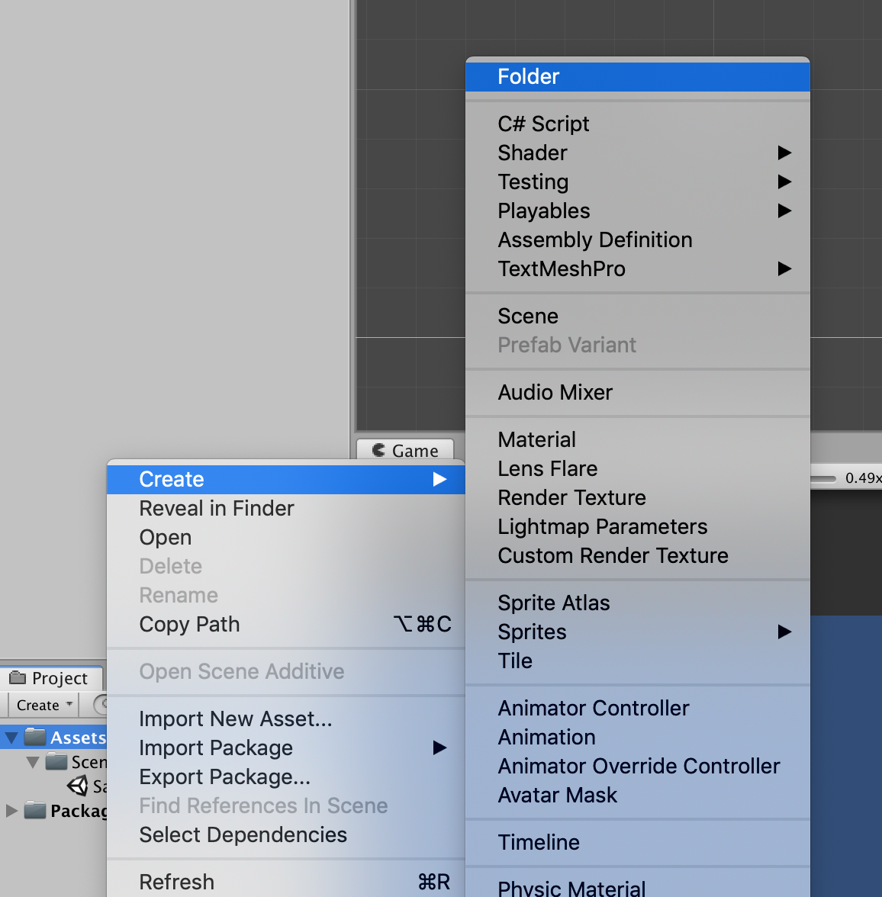

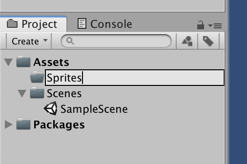

That's one way to create a folder in the Project pane. There are two more ways. To create the Scripts folder we'll use the Project pane's **Create** drop-down:

1. Note that creating a folder leaves it selected.
1. Select the **Assets** folder again - we don't want to create our **Scripts** folder in the **Sprites** folder. Not that it hasn't been done…
1. Click on the **Create** drop-down menu just above the **Assets** folder in the Project pane.
1. Select **Folder**.
1. Rename the new folder from **New Folder** to **Scripts.**

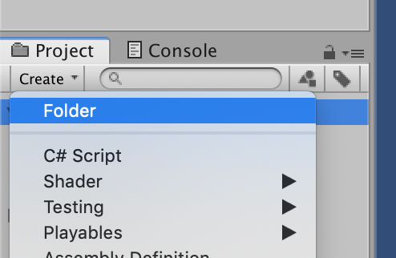

When you are done, the Project pane should look like this. The absence of *reveal triangles* to the left of the **Scripts** and **Sprites** folders tells you that they are currently empty.

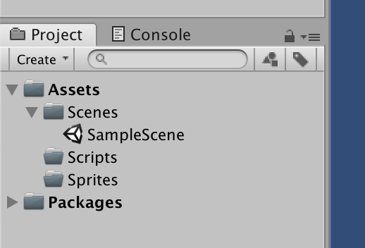

The third way to create a folder in Unity is from the **Assets** menu on the menubar. Useful if you forget the other methods, but otherwise I find it too cumbersome for regular use.

### Download Paddle and Ball images

Our sprites will start off as simple images in **P**ortable **N**etwork **G**raphics (PNG) format. We could also use JPEG images, but PNGs have the advantage of supporting transparency. Use PNGs. Most image editing software can save images in PNG format (and also export images from other formats to PNG).

The only sprites we *need* for Pong are a white circle and a white square. You could easily create them yourself in Photoshop or Piskel or any other image editor, or you can download them from here - since they are white, and the page background is white, they are not much to look at. Use these links to download the **Circle** and **Square** sprites:

* **[Circle][]**
* **[Square][]**

To download the linked images:

1. Right click on the link and choose **Download Linked File As…**.
1. Navigate to the Sprites folder in your Unity project.
1. If you want, change the file name.
1. Click **Save**

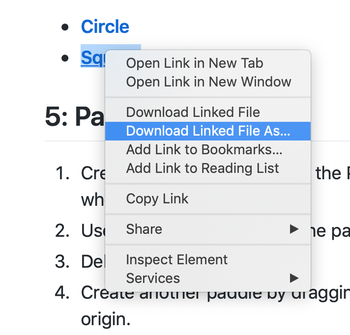
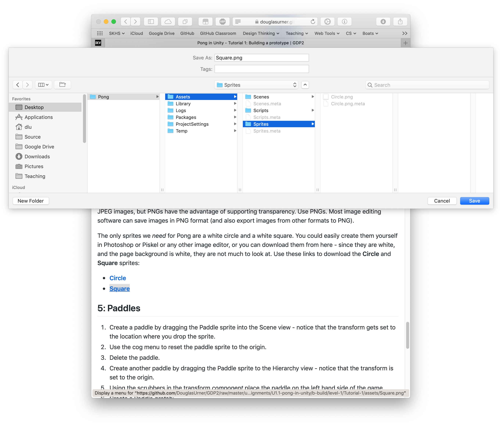

After downloading the Circle and Square images, your Unity Sprites folder should look like this:

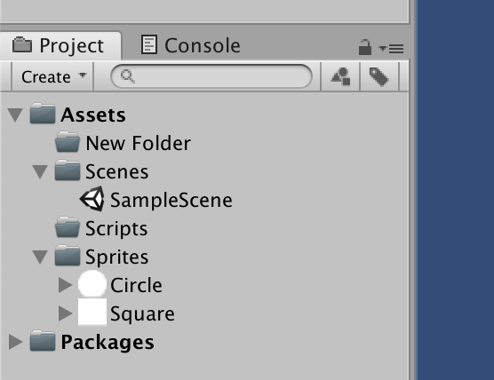

### Check the sprite import settings

Notice that each of the sprites, Circle and Square, has a reveal triangle to the left of it. The images that you downloaded have become sprites. Before we move on, let's investigate them a bit:

1. Notice that each sprite has a small icon of itself.
1. Click on the reveal triangle to open the sprite folder.
1. Inside you will find the image file that you downloaded. If you had downloaded an animated sprite the animation frames would all be stored together in the folder.
1. In the **Inspector** pane the properties of the selected sprite are displayed along with a preview. There are a few things to notice/check:
   - **Texture Type** should be set to **Sprite (2D and UI)**, if it is not your project may have been created with a 3D template. Read the Unity manual section on [2D and 3D Settings][3Dto2D] to learn how to switch your project into 2D mode (or you could start over, it would be quick, and it would be good practice).
   - **Pixels Per Unit** should be **100**, this setting scales images to the game world. Decreasing it makes the sprite larger and vice versa.
   - **Filter Mode** should be changed from the default of **Bilinear** to **Point (no filter)** for the Square, it can be left at the default for the Circle. The bilinear setting may result in fuzzy edges which will look bad on the paddles or if we use the square to form edges or the center line.
1. Click the **Apply** button to save your changes.

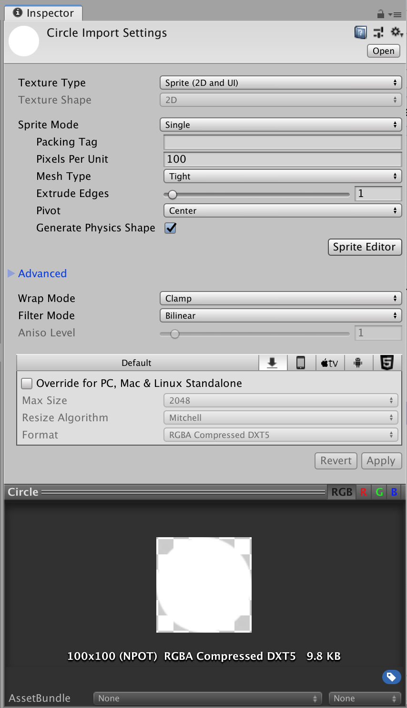

[circle]: https://github.com/DouglasUrner/GDP2/raw/master/units/1/assignments/U1.1-pong-in-unity/b-build/level-1/Tutorial-1/assets/Circle.png
[square]: https://github.com/DouglasUrner/GDP2/raw/master/units/1/assignments/U1.1-pong-in-unity/b-build/level-1/Tutorial-1/assets/Square.png
[3Dto2D]: https://docs.unity3d.com/2018.3/Documentation/Manual/2DAnd3DModeSettings.html

## 5: Set Up The Paddles

We are ready to start building the game!

### Save and rename the Sample Scene

Unity does not save automatically, work outside of the Project pane is likely to be lost if Unity crashes and you haven't saved. Save now, it is a good habit and an opportunity to give the initial scene a better name:

* From the **File** menu choose the **Save As…** option, when you choose this item you are saving the active scene with a new name. Choose a descriptive name for the scene and make sure that the **Scenes** folder is selected. You only need to do **Save As…** the first time you save a scene, or if you want to rename a scene. Note that unlike many applications, **Save As…** does not make a second copy of the scene - it renames it.
* In the future you can save you work with the keyboard shortcut **Command-S** (or **Control-S** on Windows).

### Place the first paddle and set its transform

1. Create a [Sprite][] [GameObject][] by dragging the Square sprite from the Project pane into the Scene view - notice that the *transform* [Component][] gets its values set to the location where you drop the sprite. Every game object has a [transform][] - for most game objects the transform is in "world space," the transform of child objects is in terms of the parent game object. An game object's transform is set when the object is created. You can set the tranform by moving the object in the Scene view or by entering new values in the Transform component.

   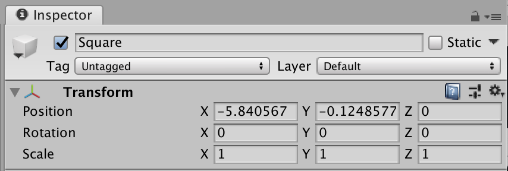

1. You can set the transform to its default values by choosing **Reset** from the cog menu in the upper right corner of the Tranform component. Try this.

   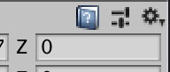

3. Delete the paddle - select it in the Hierarchy pane or Scene view and press the **Delete** key, you can also use the context menu.
1. Create another paddle by dragging the Square sprite up to the Hierarchy view - notice that the transform is set to the origin.
1. If you hover the mouse over the field labels in the Transform component, the pointer will change to a double arrow. This is a "scrubber" which you may have encountered in Photoshop or when editing audio or video. Using the scrubbers in the transform *component* to move the paddle to the left hand side of the Scene view. Then adjust the X and Y Scale values until you have a paddle that you like.
1. Save.


[component]: https://docs.unity3d.com/2018.3/Documentation/Manual/Components.html
[gameobject]: https://docs.unity3d.com/2018.3/Documentation/Manual/class-GameObject.html
[sprite]: https://docs.unity3d.com/2018.3/Documentation/Manual/Sprites.html
[transform]: https://docs.unity3d.com/2018.3/Documentation/Manual/class-Transform.html

### Make a Paddle prefab

Unity's [Prefab][] facility lets you create templates for game objects. Since Pong has two paddles it makes sense to base them on a prefab. Using prefabs helps to avoid errors and makes it easy to keep multiple objects in synch. Prefabs also let you configure an object and use it later - this is very useful when you need to spawn complex objects.

[prefab]: https://docs.unity3d.com/Manual/Prefabs.html

Here's what to do:

1. Create a **Prefabs** folder in the Project pane. The folder is not "magic" - the name *Prefabs* is a convention, not a rule.
1. Drag the Square game object from the Hierarchy view to the Prefabs folder you just created.
   - Notice how the icon changes.
1. Rename the prefab to **Paddle** in the Project pane - you can also rename it in the Inspector, but the name of the prefab must match the name of the file holding it, so if you rename it in the Inspector you will be prompted to confirm that you want to rename the file as well.
1. Delete the paddle game object from the Hierarchy pane. Note: prefabs are often created dynamically in scripts, so it is common to delete a game object after using it to create a prefab - but you don't have to. This is an occasion where it would be reasonable to leave the game object in the game, we are deleting it so that we can see how the behavior differs when we create a game object from a prefab.
1. Create two paddles by dragging in the Paddle prefab twice.
   - The first time, drag it into the Hierarchy pane. What do you expect to see as the position value in the transform?
   - The second time, drag it into the Scene pane. What do you see as the transform?
   - Name each paddle - **PaddleL** and **PaddleR**.
   - Set the postion of each paddle.
1. Click on the Play button  to test.
1. Save.

### Configure the Paddle prefab

We want to be able to move the paddles. We could do this by applying the counter pattern to the Y property of the Paddle's Transform's Position, but it will probably be easier and clearer (and more generally useful) to use a [Rigidbody2D][] component to help with the movement.

In Unity [Components][component] let us customize game objects to get the appearance and behaviors that we want.

[rigidbody2d]: https://docs.unity3d.com/Manual/class-Rigidbody2D.html

Here's what to do:

1. Select the Paddle prefab in the Project pane.
1. In the Inspector click on the **Open Prefab** button.

   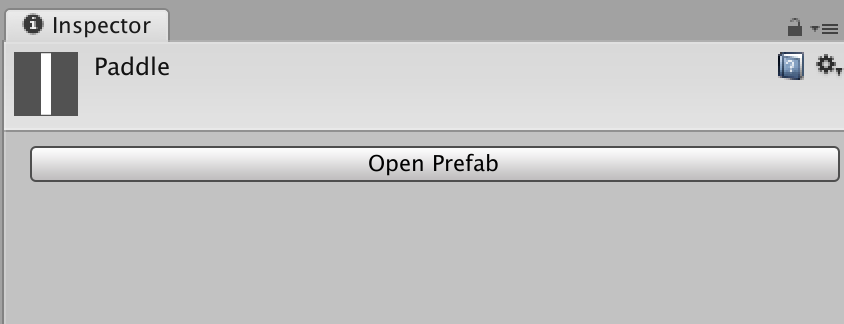
   
1. At the bottom of the Inspector pane, click on the **Add Component**.
   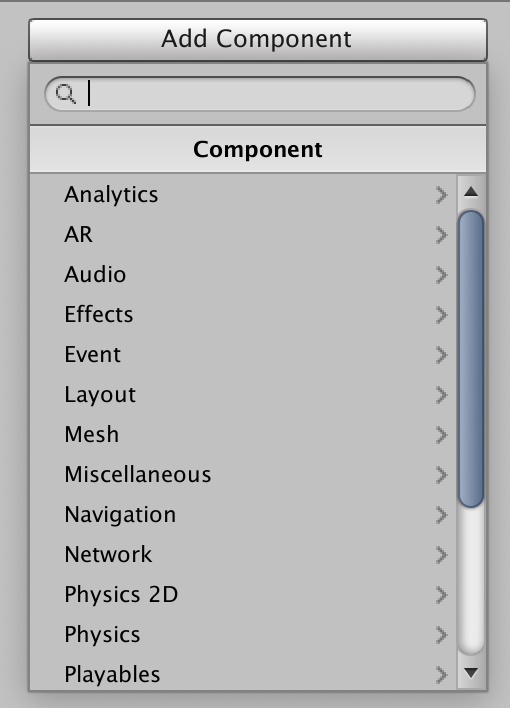
1. We are looking for the [Rigidbody2D][] component, you can either browse or find it using the search box.
1. Since we are adding the Rigidbody2D component to the Paddle prefab, both paddles will now have a Rigidbody2D component.
1. Click on the Play button  to test the game. What happens?

   Since the only change that we made was adding the Rigidbody2D component, the new behavior must be due to the Rigidbody2D. Read through the Rigidbody2D properties and see if there are any that might explain the behavior. You could also look in the Unity manual - any easy way to get to the relevenent section of the manual is to click on the blue manual button next to a components cog menu button. Try out any ideas that you have, you really can't go wrong - there is a **Reset** option in the cog menu that will restore all of the component's default settings. See if you can get the paddles to remain stationary when you press the play button, before you go on.
   
   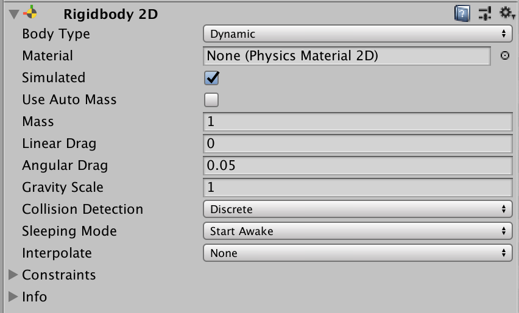
   
1. You may have figured out that setting the **Gravity Scale** property of the Rigidbody2D component will solve the problem. Before we go on, click on the **Body Type** drop down and look at the options.

   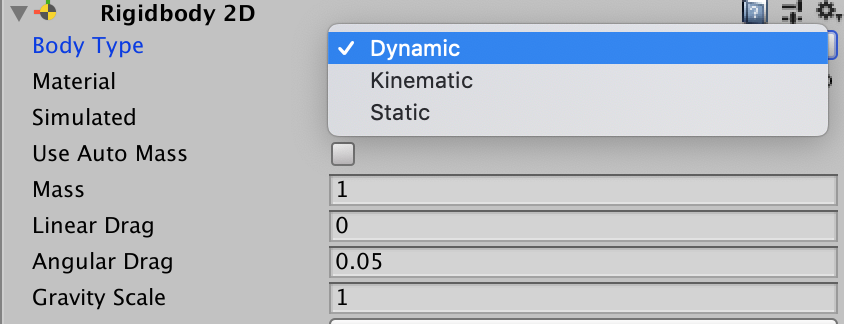
   
   A Body Type setting of **Dynamic** means that the game object will participate in the Physics system and will move in response to collisions with other game objects. A setting of **Kinematic** means that the object will only move if we tell it to (for example by setting its **Velocity** property). The **Static** setting is used for objects that don't move. Try setting the Body Type to each of the options and see how the Rigidbody2D properties change.
   
   So, we could also avoid the "gravity problem" by setting the Body Type to Kinematic. But there are tradeoffs and we will use a **Body Type** of **Dynamic.**
   
1. Check that **Body Type** is set to **Dynamic**, and that **Gravity Scale** is set to **0**.
1. Test again.
1. Save.
   
## 6: The PaddleController Script

In Unity scripts are C# *classes* that implement custom behaviors for game objects. They are attached to game objects like any other component.

### Create a script file named PaddleController

1. Right click on the **Scripts** folder in the Project pane. From the context menu choose **Create > C# Script.**
1. Name the script **PaddleController.** The name of the script **must** match the name of the *class* that is declared in the script (the name for the body of code that we are going to write). This means that the file name must be a legal C# identifyer name. Roughly speaking that means that the file name:
   - Starts with a letter.
   - Contains no spaces.
   - Doesn't include punctuation, other than the underscore character.
   By convention class names start with a capital letter and are *CamelCased*.
   You can find the full details [here](https://docs.microsoft.com/en-us/dotnet/csharp/language-reference/language-specification/lexical-structure#identifiers).
1. The resulting C# file, named **PaddleController.cs** (but Unity does not show extensions in the Project pane), will look like this:

```C#
using System.Collections;
using System.Collections.Generic;
using UnityEngine;

public class PaddleController : MonoBehaviour
{
    // Start is called before the first frame update
    void Start()
    {
        
    }

    // Update is called once per frame
    void Update()
    {
        
    }
}
```

1. The script won't do anything yet, but let's attach it to the Paddle prefab so that we can test as we go:
   - Select and **Open** the Paddle prefab.
   - Click on the **Add Component** button.
   - In the search box start typing **PaddleController**.
   - Select the script to attach it to the Paddle prefab.
1. Test - nothing should happen, but there should also be no errors.

### Moving the paddles

We want to move the paddles in response to keyboard input from the players. We will let the players decide what keys they want to use. When we detect input we will set the **velocity** property of the Rigidbody2D and the physics system will move the paddles.

```C#
using System.Collections;
using System.Collections.Generic;
using UnityEngine;

public class PaddleController : MonoBehaviour
{
    /*
     * Public variables will show up as properties in the
     * Inspector - values set here will be used as defaults.
     * Once a value is set in the Inspector, changes to the
     * prefab will not override.
     */
    public KeyCode moveUp = KeyCode.None;
    public KeyCode moveDown = KeyCode.None;
    public float speed = 12.0f;
    
    private Rigidbody2D rb;

    // Use this for initialization
    void Start() {
        /*
         * Finding components is a relatively expensive operation
         * so we do it once here rather than every frame in Update().
         */
        rb = GetComponent<Rigidbody2D>();
        
        if (moveUp == KeyCode.None || moveDown == KeyCode.None) {
            // Warn if KeyCodes are not set.
            Debug.Log("KeyCodes not set");
        }
    }
	
    // Update is called once per frame
    void Update() {
        var vel = rb.velocity;
        
        if (Input.GetKey(moveUp)) {
            vel.y = speed;
        } else if (Input.GetKey(moveDown)) {
            vel.y = -speed;
        } else {
            vel.y = 0;
        }
        rb.velocity = vel;
    }
}
```
   
## 7: The Ball

Add collider to paddle
1. Drag Ball sprite to Hierarchy
   - Make it a prefab
   - Add tag (be sure it goes on the prefab)
   - Adjust scale (0.5, 0.5)
   - Create and add Physics 2D material
     - Drag to Physics 2D component
   - Add BallController script
   
## 8: The BallController Script

## 9: Edges
1. Create empty game object - Edges
   - Reset transform
   - Create an empty child, name it Top
   - Add a box collider
   - Adjust size of collider
   - Position collider with transform
   - Duplicate three times, Right, Bottom, Left (or N, E, S, W)
1. Test
